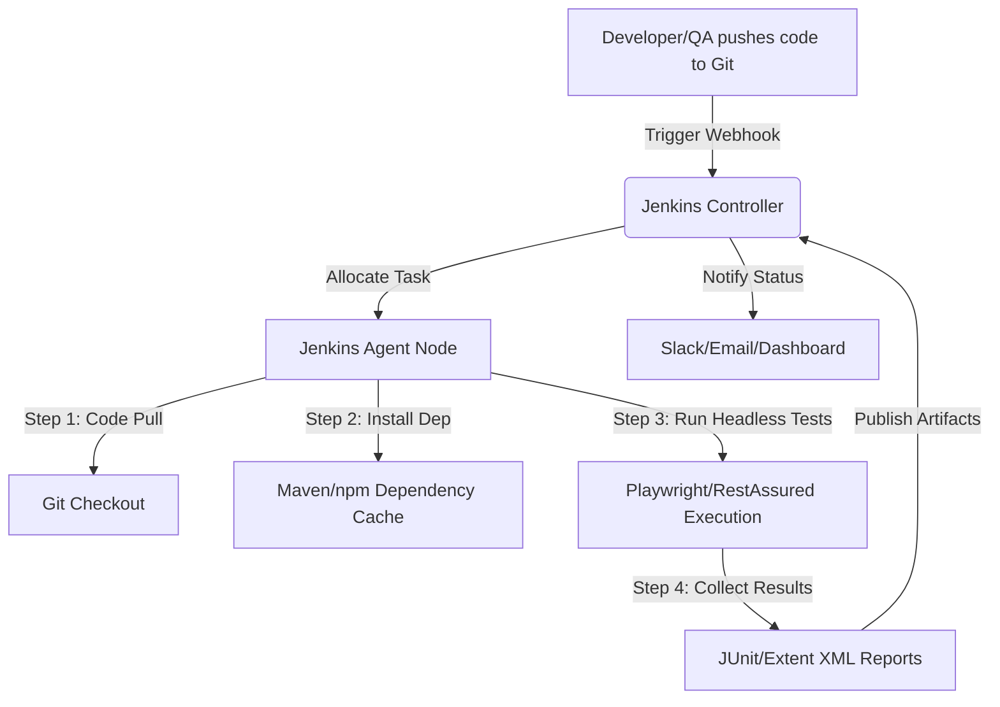

# Jenkins & CI/CD in Test Automation — Complete Guide

> **Core Topic**: Continuous Integration, Continuous Delivery, and Jenkins Orchestration  
> **Target Audience**: Quality Assurance Engineers, SDETs, and DevOps Learners  
> **Purpose**: A comprehensive guide to understanding, building, and troubleshooting automated pipelines.

---

## Table of Contents

1. [Section 1: Continuous Integration & Continuous Delivery (CI/CD) — ELI20](#section-1-continuous-integration--continuous-delivery-cicd--eli20)
2. [Section 2: Jenkins — ELI20](#section-2-jenkins--eli20)
3. [Section 3: Jenkins & CI/CD in Automation Testing](#section-3-jenkins--cicd-in-automation-testing)
4. [Section 4: Jenkins Q&A Bank (30 Questions & Answers)](#section-4-jenkins-qa-bank-30-questions--answers)
5. [Section 5: CI/CD Q&A Bank (30 Questions & Answers)](#section-5-cicd-qa-bank-30-questions--answers)

---

## Section 1: Continuous Integration & Continuous Delivery (CI/CD) — ELI20

Imagine you are running a **fast-food burger kitchen**. 

In the old days, a chef would make a massive batch of burgers in the morning, wrap them up, and put them in a heating tray. If the chef accidentally added too much salt to the meat, no one would know until a customer bit into a burger hours later. By then, hundreds of salty burgers had already been wrapped and stacked. Fixing the error meant throwing away the entire batch and starting over.

**Continuous Integration (CI)** is like installing a smart assembly line where:
1. Every time a chef prepares a single burger patty, they place it on a conveyor belt.
2. An automated sensor instantly tests the patty's temperature and saltiness.
3. If the patty passes, it goes to the dressing station. If it fails, an alarm goes off immediately, the belt stops, and the chef can fix the recipe for the very next patty before wasting any more meat.

In software, the "burger patties" are code changes written by developers. Continuous Integration ensures that every time a developer saves and uploads their code, it is immediately compiled, built, and tested. If a change breaks the app, the team knows within minutes.

**Continuous Delivery (CD)** is like putting those verified burgers in a clean warming rack, boxed and ready. The moment the cashier presses a button, the burger is ready to be handed to the customer. The delivery process is completely automated and prepped, but a human still decides exactly *when* to press the button to release it.

**Continuous Deployment (also CD)** goes one step further: the moment the burger passes the sensors, it is automatically slid directly onto the customer's tray via a chute without a cashier having to press any buttons. In software, this means every passing code change goes straight to the production website.

---

## Section 2: Jenkins — ELI20

If CI/CD is the kitchen's assembly line, then **Jenkins is the Head Kitchen Conductor**. 

Jenkins itself does not grill the patties, slice the tomatoes, or wrap the burgers. Instead, it is a highly coordinated conductor robot that tells all the other kitchen tools what to do:
- It monitors the order screen (like watching GitHub for new code).
- The moment an order comes in, it tells the oven to turn on, sets the temperature, and commands the robot arm to place the patty.
- It schedules helpers (agents) to do specific tasks. It might send the patty-grilling task to the grill station (a Linux server agent) and the bun-toasting task to the toaster station (a Windows server agent).
- If any station reports an error, Jenkins rings the alarm, stops the line, and sends a notification to the manager's phone.

In software, Jenkins is an **automation server**. It reads a recipe file (called a `Jenkinsfile`) that outlines the steps required to build, test, and release code. It coordinates compiling code, running automation tests (such as Playwright UI suites or REST-Assured API scripts), collecting test reports, and deploying the software.

---

## Section 3: Jenkins & CI/CD in Automation Testing

In modern software testing, running regression suites manually on a tester's local machine is an anti-pattern. Local environments are prone to "it works on my machine" issues due to local configurations, caches, and hardware differences. 

Automating execution within a CI/CD pipeline solves this by enforcing **isolation, repeatability, and immediate feedback**. Here is how it works under the hood:



### Key Integration Points:
1. **SCM Triggers & Webhooks**: Every time a test case or application code is updated in Git, Git notifies Jenkins via an HTTP POST request (Webhook). This triggers the automated pipeline.
2. **Headless Execution**: Since Jenkins servers run in data centers without physical monitors, UI automation tools like Playwright run in **headless mode** (simulating the browser in memory).
3. **Artifact Archiving**: After the run finishes, Jenkins archives and displays HTML reports, logs, and video recordings of failed tests directly on the build dashboard.

---

## Section 4: Jenkins Q&A Bank (30 Questions & Answers)

### Q1. What is Jenkins and how does it fit in the automation ecosystem?
**Answer:**  
Jenkins is an open-source automation server written in Java. It orchestrates the CI/CD pipeline by automating software compile, build, test, and deployment processes. In the automation testing ecosystem, Jenkins acts as the scheduling and execution hub, triggering test scripts (Maven, Gradle, npm) automatically upon code commits or on specific schedules (CRON).

### Q2. Explain the Master-Agent (Controller-Agent) architecture in Jenkins.
**Answer:**  
The **Controller (Master)** is the brain of Jenkins. It hosts the UI, handles configurations, schedules jobs, monitors builds, and manages plugins.  
The **Agents (Nodes)** are workhorse servers that execute the actual build steps defined in pipelines. The Controller allocates jobs to Agents based on resource availability and agent labels (e.g., executing UI tests on a Node labeled `windows-chrome`).

### Q3. What is a Jenkinsfile? Explain Declarative vs. Scripted pipelines.
**Answer:**  
A `Jenkinsfile` is a text document that defines the entire CI/CD pipeline as code, checked into the project's Git repository. There are two syntaxes:
- **Declarative Pipeline**: A structured, user-friendly syntax with strict sections (`pipeline`, `agent`, `stages`, `steps`, `post`). Easier to read and maintain.
- **Scripted Pipeline**: An older Groovy-based syntax that offers maximum flexibility and programmatic control but is harder to write and maintain.

### Q4. How do you securely handle passwords, tokens, and private keys in Jenkins?
**Answer:**  
We use the **Credentials Plugin** in Jenkins. Secrets are stored encrypted in the Jenkins credentials store. In the `Jenkinsfile`, we bind these secrets to temporary environment variables using the `withCredentials` block or `credentials()` helper, ensuring they are masked in the console log:
```groovy
environment {
    API_TOKEN = credentials('my-secret-token-id')
}
```

### Q5. What is the difference between a Freestyle project and a Pipeline project?
**Answer:**  
- **Freestyle project**: Configured entirely via the Jenkins web UI using forms and dropdowns. Hard to version control or track changes.
- **Pipeline project**: Configured using code (`Jenkinsfile`). This allows pipelines to be version-controlled, code-reviewed, and easily duplicated across repositories.

### Q6. How do you trigger a Jenkins pipeline automatically?
**Answer:**  
Common triggers include:
- **GitHub/GitLab Webhook**: Triggers immediately when a developer pushes code.
- **Poll SCM**: Jenkins periodically polls Git to check for changes (e.g. `H/5 * * * *` every 5 minutes).
- **Build Periodically**: Runs on a timed CRON schedule (e.g., `0 22 * * 1-5` for nightly regression).
- **Triggered via API**: Initiated via curl requests from other tools.

### Q7. How do you pass parameters to a Jenkins pipeline dynamically?
**Answer:**  
We define parameters at the top of the declarative pipeline. Users can input values when triggering "Build with Parameters", or external scripts can pass them via API:
```groovy
parameters {
    string(name: 'TEST_SUITE', defaultValue: 'Smoke', description: 'Tests to run')
    choice(name: 'BROWSER', choices: ['chromium', 'firefox', 'webkit'], description: 'Target browser')
}
```

### Q8. What is the purpose of the `post` block in a declarative pipeline?
**Answer:**  
The `post` block runs at the end of a pipeline execution, regardless of status. It has conditional execution blocks:
- `always`: Runs every time (used for workspace cleanup or publishing test reports).
- `success`: Runs only if the build passes.
- `failure`: Runs if any stage fails (used to send Slack/Email notifications).
- `unstable`: Runs if tests fail but compile succeeded.

### Q9. How do you run automation tests in parallel across different nodes in Jenkins?
**Answer:**  
We use the `parallel` directive inside a stage. This spins up tasks simultaneously on multiple agents:
```groovy
stage('Parallel Execution') {
    parallel {
        stage('Windows Chrome Tests') {
            agent { label 'windows-chrome' }
            steps { sh 'mvn test -Dbrowser=chrome' }
        }
        stage('Linux Firefox Tests') {
            agent { label 'linux-firefox' }
            steps { sh 'mvn test -Dbrowser=firefox' }
        }
    }
}
```

### Q10. What is a "Multi-branch Pipeline" and why is it preferred?
**Answer:**  
A Multi-branch Pipeline automatically scans a Git repository and creates a Jenkins job for every branch containing a `Jenkinsfile`. This ensures pull requests (PRs) and feature branches are built and tested in isolation automatically before merging to the `main` branch.

### Q11. How do you archive and display test reports (e.g., Extent, JUnit, Allure) in Jenkins?
**Answer:**  
We use post-build publishing plugins inside the `always` block of the `post` section. For example, to publish JUnit XML results:
```groovy
post {
    always {
        junit 'target/surefire-reports/*.xml'
        archiveArtifacts artifacts: 'target/reports/**/*', onlyIfSuccessful: false
    }
}
```

### Q12. Explain the difference between `unstable` and `failed` build statuses in Jenkins.
**Answer:**  
- **Failed**: The pipeline encountered a system error, script crash, compilation failure, or infrastructure outage.
- **Unstable**: The pipeline script executed completely, but test assertions failed. This status is typically set by test report publishers (like the JUnit plugin) to signal that code built successfully but functional quality gates failed.

### Q13. How do you configure a Jenkins pipeline to send Slack notifications on build failures?
**Answer:**  
1. Install the **Slack Notification Plugin** in Jenkins.
2. Configure a Slack App/Webhook in your Slack workspace.
3. Call the `slackSend` step inside the `failure` block in your `Jenkinsfile`:
```groovy
post {
    failure {
        slackSend channel: '#qa-alerts',
                  color: '#FF0000',
                  message: "FAILED: Job '${env.JOB_NAME}' [build #${env.BUILD_NUMBER}] - ${env.BUILD_URL}"
    }
}
```

### Q14. What are Jenkins Shared Libraries and how do they help SDETs?
**Answer:**  
Jenkins Shared Libraries are reusable Groovy scripts stored in a separate Git repository. They allow teams to write common utility steps (e.g., notifying Slack, writing database test states, spinning up test nodes) once and import them across dozens of individual project `Jenkinsfiles`:
```groovy
@Library('my-global-library') _
stage('Notify') {
    sendCustomSlackNotification()
}
```

### Q15. How do you handle workspace cleanup on Jenkins nodes?
**Answer:**  
To prevent disk space issues, we use the **Workspace Cleanup Plugin** (`cleanWs`). We typically call it at the beginning of the run to clear stale data, and in the `always` block of the `post` section to leave the node clean:
```groovy
post {
    always {
        cleanWs()
    }
}
```

### Q16. Name 5 essential Jenkins plugins for test automation engineers.
**Answer:**  
1. **Git Plugin**: Connects SCM repositories to pull code.
2. **Pipeline Plugin**: Enables the execution of code-defined pipelines.
3. **Credentials Binding Plugin**: Inject credentials securely into steps.
4. **Workspace Cleanup Plugin**: Cleans agent workspaces to prevent out-of-disk errors.
5. **JUnit Plugin / ExtentReports Plugin**: Parses XML test results and presents charts on the build page.

### Q17. How do you restrict a pipeline execution to run only on a specific Jenkins agent?
**Answer:**  
We define the agent labels in the `agent` section of the stage or pipeline block:
```groovy
pipeline {
    agent { label 'qa-docker-runner' }
    // stages...
}
```
This forces Jenkins to locate an agent marked with the `qa-docker-runner` label to execute the pipeline.

### Q18. How do you run UI automation tests (headless) on a Linux agent without a display server?
**Answer:**  
Linux servers run headless without graphical display panels. Modern tools (like Playwright) run in virtual headless environments natively. If using older tools like Selenium WebDriver, we wrap execution using the **Xvfb (Virtual Frame Buffer) plugin** in Jenkins:
```groovy
wrap([$class: 'Xvfb']) {
    sh 'mvn test'
}
```

### Q19. How do you handle pipeline timeouts for long-running automation suites?
**Answer:**  
To prevent hang scenarios (e.g. an infinite loop or hung driver process) from locking up Jenkins executors indefinitely, we wrap stages or the entire pipeline in a `timeout` block:
```groovy
options {
    timeout(time: 2, unit: 'HOURS') // Fails build if it takes longer than 2 hours
}
```

### Q20. What is Jenkins Configuration as Code (JCasC)?
**Answer:**  
JCasC allows administrators to define the entire state of the Jenkins controller (plugins, security settings, agent definitions, credentials configurations) using a single YAML file. This replaces manual setup via the Jenkins UI and makes server migration or recovery instant.

### Q21. How do you automatically retry a failed build stage in a Jenkinsfile?
**Answer:**  
We use the `retry` step wrapper inside a stage to execute steps again up to a specified threshold:
```groovy
stage('Flaky API Check') {
    steps {
        retry(3) { // Retries execution up to 3 times before failing
            sh 'curl -f https://api.example.com/health'
        }
    }
}
```

### Q22. How do you access standard environment variables in a Jenkins pipeline?
**Answer:**  
Jenkins injects default variables into the environment, accessible via `env.VARIABLE_NAME`:
- `env.BUILD_NUMBER`: Current build count.
- `env.BRANCH_NAME`: Current branch being compiled.
- `env.BUILD_URL`: Direct link to build details.

### Q23. What is the difference between `sh` and `bat` steps in a Jenkinsfile?
**Answer:**  
- `sh`: Executes a shell command on Unix-like operating systems (Linux, macOS agents).
- `bat`: Executes a batch command on Windows operating systems (Windows agents).

### Q24. How do you manage Jenkins backups?
**Answer:**  
Everything in Jenkins is stored in a directory called `JENKINS_HOME`. We back up the configurations, build logs, and job history by backing up this directory, excluding temporary workspaces, or by using plugins like ThinBackup.

### Q25. What is the Build Queue in Jenkins?
**Answer:**  
The Build Queue is a list of triggered jobs waiting for an available executor slot on a compatible agent. If all agent executors are busy, new jobs wait in this queue until one is freed.

### Q26. How do you execute automation tests inside a temporary Docker container using Jenkins?
**Answer:**  
We configure the `agent` section to download and launch a specific Docker image. Jenkins automatically mounts the project workspace inside that container, executes the build, and destroys the container afterward:
```groovy
agent {
    docker {
        image 'mcr.microsoft.com/playwright/java:v1.40.0-jammy'
        args '-v /var/run/docker.sock:/var/run/docker.sock'
    }
}
```

### Q27. What are downstream and upstream jobs?
**Answer:**  
- **Upstream Job**: A project build that triggers another job (e.g., compiling the application code).
- **Downstream Job**: A project build triggered by another job (e.g., triggering the QA automation suite only after the compile job completes successfully).

### Q28. How do you debug a pipeline that gets stuck indefinitely?
**Answer:**  
1. Check the console output of the running job to identify the active step.
2. Inspect the agent's system resource utilization (RAM/CPU/Disk).
3. If running UI tests, ensure they are in headless mode so they do not block waiting for a graphical frame buffer.
4. Click the thread dump utility in Jenkins on the running build page to pinpoint the exact Java line blocking the execution thread.

### Q29. How do you set up agent nodes dynamically in a cloud environment?
**Answer:**  
Instead of running static, permanently active servers, we configure Jenkins plugins for AWS EC2 or Kubernetes. When a job queue fills up, Jenkins sends an API call to boot up an EC2 instance or launch a Kubernetes pod. The agent connects, executes the job, and automatically terminates once idle.

### Q30. Explain how to trigger a Jenkins job programmatically via API.
**Answer:**  
We send an HTTP POST request to the build URL with user authentication tokens:
```bash
curl -X POST -u "admin:API_TOKEN" "https://jenkins.example.com/job/RunRegression/buildWithParameters?SUITE=Smoke"
```

---

## Section 5: CI/CD Q&A Bank (30 Questions & Answers)

### Q1. What is the difference between Continuous Integration, Continuous Delivery, and Continuous Deployment?
**Answer:**  
- **Continuous Integration (CI)**: Automating code compiling, building, and unit testing immediately after developer commits.
- **Continuous Delivery (CD)**: Automatically preparing the build for release to production. The deployment payload is verified and staged, but requires manual approval to go live.
- **Continuous Deployment (CD)**: Completely automated release pipeline. Every change that passes automated regression testing goes straight to production systems without human intervention.

### Q2. Why is CI/CD crucial for Agile software development and QA?
**Answer:**  
CI/CD reduces feedback loop times. Instead of waiting for weekly/monthly release windows to find bugs, teams discover regressions within minutes of code changes. This reduces merge conflicts, improves release quality, and allows developers to fix issues while their code context is fresh.

### Q3. Explain the Git Branching Strategy (GitFlow vs. Trunk-Based) and its impact on CI/CD.
**Answer:**  
- **GitFlow**: Uses feature, develop, release, and hotfix branches. Good for structured release cycles, but creates long-lived branches and complex integration efforts.
- **Trunk-Based Development**: Developers push small changes directly to the main branch (`trunk`) daily. Pipelines build and test continuously, reducing merge conflicts and enabling faster feature delivery.

### Q4. What is a Webhook and how does it differ from Polling?
**Answer:**  
- **Polling**: The CI server constantly asks Git, "Are there any updates yet?" (wastes server resources and causes delay).
- **Webhook**: Git pushes a notification to the CI server immediately when an event occurs (instant execution, zero polling overhead).

### Q5. What is a Quality Gate in a CI/CD pipeline?
**Answer:**  
A Quality Gate is a set of threshold metrics that must be met before code can progress to the next stage of the pipeline. Examples:
- 100% test compile success.
- Zero critical vulnerability findings in security scans.
- Unit test coverage $\ge 80\%$.
- 100% smoke test pass rate.

### Q6. How does static code analysis (e.g., SonarQube) integrate into a CI/CD pipeline?
**Answer:**  
During the compile/build stage, the SonarQube scanner runs to analyze the code for code smells, bugs, duplicate blocks, and security weaknesses. If the scan metrics violate configured thresholds, SonarQube fails the quality gate, halting the pipeline before automated deployment starts.

### Q7. What are build artifacts and where should they be stored?
**Answer:**  
Build artifacts are compiled, packaged outputs of a build run (e.g. `.jar`, `.war`, `.zip` files, Docker images). They should be stored in dedicated artifact repositories (like Nexus, JFrog Artifactory, or AWS ECR) to ensure version control and reliable deployments.

### Q8. How do you handle database migrations in a CD pipeline?
**Answer:**  
We automate database schema changes using tools like Liquibase or Flyway. These tools run migrations as versioned SQL scripts. During the deployment stage, the tool compares the database schema version against the target code version and applies missing migrations automatically.

### Q9. Explain the concept of Blue-Green deployment.
**Answer:**  
Blue-Green deployment uses two identical production environments:
- **Blue**: Currently active production system hosting live traffic.
- **Green**: Idle environment where the new release is deployed and smoke-tested.
Once green is verified, the load balancer switches traffic from Blue to Green. If issues occur, rollback is instant by switching back to Blue.

### Q10. What is Canary deployment?
**Answer:**  
Canary deployment releases the update to a small subset of servers or users (e.g., 5% of traffic) first. The pipeline monitors error rates and system performance on the canary node. If no issues are detected, the release slowly rolls out to the remaining 95% of users.

### Q11. How does security testing (SAST/DAST) integrate into a CI/CD workflow?
**Answer:**  
- **SAST (Static Application Security Testing)**: Scans source code during build compiles to catch vulnerabilities (like SQL Injection) early.
- **DAST (Dynamic Application Security Testing)**: Scans the running web application in staging/QA environments to detect runtime vulnerabilities.

### Q12. What is Infrastructure as Code (IaC) and how does it relate to CI/CD?
**Answer:**  
IaC defines system environments (servers, load balancers, database instances) using configuration files (e.g. Terraform, CloudFormation). In CI/CD, IaC scripts run automatically to spin up identical testing environments before tests execute, destroying them afterward to prevent environment drift.

### Q13. How do you prevent flaky test suites from blocking the release pipeline?
**Answer:**  
- **Quarantine Tagging**: Move known flaky tests to a quarantined suite to fix them without blocking code builds.
- **Auto-Retry**: Run failed tests up to 2-3 times before flagging the build.
- **Strict Assertions vs. Soft Assertions**: Log secondary assertions as warning steps instead of failing the pipeline run.

### Q14. What is the difference between push-based and pull-based CI/CD models?
**Answer:**  
- **Push-based**: The CI system pushes changes out to the target environment (e.g., running ssh deploy scripts).
- **Pull-based (GitOps)**: An agent inside the target system monitors Git for changes and pulls new configurations to match the Git state.

### Q15. What are the DORA metrics and why are they important?
**Answer:**  
DORA metrics measure pipeline speed and reliability:
1. **Deployment Frequency**: How often code is shipped.
2. **Lead Time for Changes**: Time taken from commit to production.
3. **Mean Time to Restore (MTTR)**: Time taken to recover from system outages.
4. **Change Failure Rate**: Percentage of deployments causing failures.

### Q16. How do you run security credential scanning (like Gitleaks) in CI/CD?
**Answer:**  
We configure a pre-build step in the pipeline that runs tools like Gitleaks or Trufflehog. These tools scan the commit diff history for exposed secrets (like AWS keys or database passwords). If a secret is found, the build fails immediately before the code gets merged.

### Q17. Explain the importance of pipeline isolation.
**Answer:**  
Without isolation, concurrent pipeline runs share resources, database records, and temp folders on the same execution agent. This causes test failures due to race conditions. Using isolated runners (like temporary Docker containers) ensures each run starts with clean, independent systems.

### Q18. How do you manage configuration profiles across environments in CI/CD?
**Answer:**  
We externalize configs. The application reads from environment variables rather than hardcoded configuration properties. The pipeline injects the correct variables (e.g. `DB_URL`, `API_KEY`) based on the targeted deploy environment (QA, Staging, Prod).

### Q19. What is a Smoke Gate and how does it differ from Regression testing?
**Answer:**  
- **Smoke Gate**: Runs a small set of tests (10–15 critical user flows) in minutes to verify that the app is stable enough for deeper testing.
- **Regression Suite**: Runs a comprehensive set of tests covering all features to detect edge-case bugs. Usually scheduled nightly due to execution length.

### Q20. How do you handle dependencies caching in CI pipeline runs?
**Answer:**  
CI runners configure caching rules for dependency folders (e.g. `.m2` for Maven, `node_modules` for npm). The runner restores this cache before compiling and updates it when dependencies change, reducing build times.

### Q21. Explain the role of Service Virtualization (Mocking) in CI/CD pipelines.
**Answer:**  
If a test suite depends on external third-party APIs (like credit bureaus or payment gateways) that are slow, costly, or unstable, we use mocking tools (like WireMock) to simulate API responses. This ensures fast, reliable, and cost-free execution.

### Q22. How do you coordinate multi-service deployments in microservices?
**Answer:**  
We use contract testing (e.g. Pact) to ensure changes in one microservice do not break downstream APIs. Each service maintains its own independent deployment pipeline, and backwards compatibility is enforced.

### Q23. What is GitOps?
**Answer:**  
GitOps is an operational framework where the Git repository is the single source of truth for the desired system state. Automated tools pull configurations from Git and apply changes to match the declared state.

### Q24. How do you design pipelines to fail fast?
**Answer:**  
Arrange pipeline stages by execution speed and dependency hierarchy:
1. Static analysis, linting, and compile checks.
2. Unit tests (take seconds).
3. API tests (take minutes).
4. UI regression tests (take hours).
If stage 1 fails, the run stops immediately, saving time and computing resources.

### Q25. What is a Rolling Update?
**Answer:**  
A Rolling Update upgrades instances of an application gradually. For example, in a cluster of 4 servers, the system updates server 1, routes traffic to it, then updates server 2, and so on. This maintains system availability during releases.

### Q26. How do you handle configuration secrets in CI/CD platforms securely?
**Answer:**  
Secrets are stored in vault managers (like HashiCorp Vault, AWS Secrets Manager, or GitHub Secrets). The pipeline accesses these values during execution, and they are masked in all console logs.

### Q27. What is Post-Deployment Verification?
**Answer:**  
This is a small suite of smoke tests executed automatically on the production system immediately after a deploy. This confirms that the deployment succeeded, services are running, and database connections are healthy in production.

### Q28. What does container orchestration bring to CI/CD?
**Answer:**  
Orchestration systems (like Kubernetes) allow pipelines to deploy, scale, and manage applications automatically. They handle rolling updates, self-healing nodes, and horizontal scaling out of the box.

### Q29. How do you handle configuration drift in automated environments?
**Answer:**  
Configuration drift occurs when manual updates make environments differ from their documented setup. We prevent this by disabling manual login access to servers and using automated IaC tools to rebuild environments from scratch periodically.

### Q30. What is a Feature Toggle (Feature Flag) and how does it interact with CI/CD?
**Answer:**  
A Feature Toggle allows developers to merge incomplete code into the main branch behind a configuration switch. The code is deployed to production via CI/CD but remains hidden from users until toggled on in the UI, enabling safe continuous integration.
